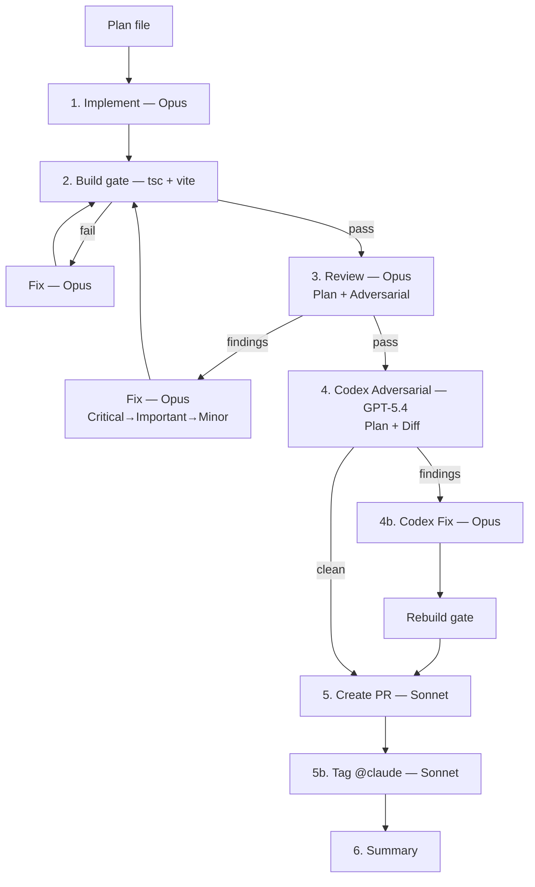
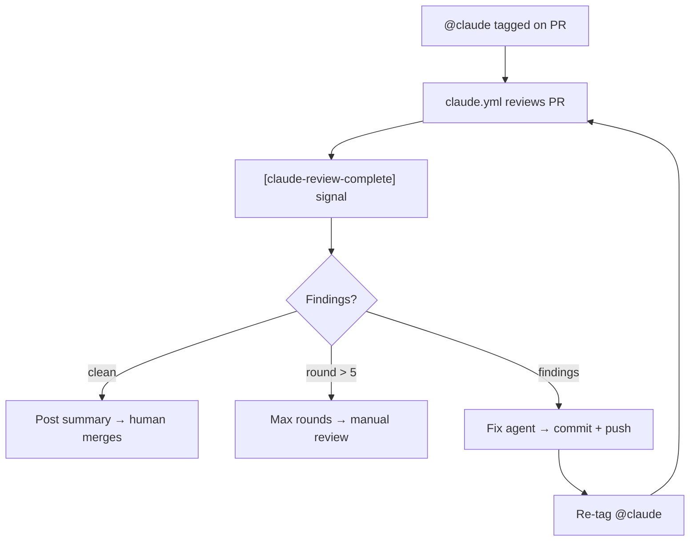

# iaGO-OS

<div align="center">


**Turn Claude Code into a disciplined project delivery system.**

*Plan with verification. Implement with TDD. Review with multiple models. Ship with evidence.*

</div>

---

A configuration layer for [Claude Code](https://claude.ai/code) that turns it into a structured project delivery system.

iaGO-OS is not a framework, not an SDK, and not a SaaS product. It's a set of files — markdown skills, agent profiles, hook scripts, and state management — that sit alongside your code in `.claude/` and `.iago/` directories. When Claude Code loads your project, it reads these files and becomes a disciplined delivery system instead of a blank-slate chatbot.

**Who it's for:** Teams and solo developers shipping real projects with Claude Code. We built it for our own 3-person AI consultancy running multiple client projects simultaneously.

**What it solves:**

- **Context rot.** Claude forgets everything between sessions. Hooks save and restore session state automatically.
- **Config drift.** Without constraints, Claude writes inconsistent code. Rules and hooks enforce your stack, conventions, and review standards.
- **Invisible work.** Subagents run in the dark. Profiles define what each agent can do, and every task ends with evidence — not claims.
- **No workflow.** Claude will skip tests and call it done. iaGO-OS imposes a pipeline: plan with verification, implement with TDD, review with multiple models, verify against goals.

---

## What's Inside

```
 34 Skills          12 Agent Profiles       8 Hooks            13 Capabilities
 ─────────          ────────────────        ──────             ───────────────
 Workflow (9)       fullstack               context-persist    react-19
 Setup (6)          frontend                usage-tracker      dynamodb
 Core (6)           backend                 safety-guard       lambda
 Content (5)        review-single           config-protection  cognito
 Experimental (5)   review-full             commit-quality     tdd
 Industry (2)       security-audit          post-edit-format   security
                    research                post-edit-types    e2e
 + Codex (6)        e2e                     post-edit-console  review-spec
 + Claude Code (4)  infra                                      review-quality
                    schema                                     content
                    content                                    infra
                    debug                                      forms
                                                               animation
```

**Optional addon:** [Memory Stack](#memory-stack-optional) adds persistent cross-session memory via MemPalace (conversation recall) + Graphify (knowledge graphs).

---

## Quick Start

```bash
# 1. Clone
git clone https://github.com/iagoai/iago-os.git && cd iago-os

# 2. Install skills globally
./scripts/sync-skills.sh --global

# 3. Scaffold a project
./scripts/new-client.sh --name "My Client" --project "my-app" --path ../my-app

# 4. Start working
cd ../my-app && claude
```

Inside Claude Code:

```
> /iago:init                    # Discovery → PROJECT.md + ROADMAP.md
> /iago:discuss phase 1         # Clarify ambiguities → context artifact
> /iago:plan phase 1            # Decompose → plan files with verify commands
> /iago:execute phase 1         # Dispatch agents → build → review → PR
> /iago:verify phase 1          # Goal verification → ship or re-plan
```

Bypass modes:

```
> /iago:quick Add email validation to the form    # 1-3 tasks, full pipeline
> /iago:fast Fix the typo in the login button      # Inline, no agents
> /iago:prfix                                      # Auto-fix PR review comments
```

See [docs/SETUP.md](docs/SETUP.md) for detailed instructions (Windows + macOS).

---

## Choosing the Right Mode

| | `/iago:execute` | `/iago:quick` | `/iago:fast` | `/iago:prfix` |
|---|---|---|---|---|
| **Plans** | Uses existing | Creates on-the-fly | None | None |
| **Pipeline** | Full 8-stage | Full 8-stage | Build gate only | GitHub Action loop |
| **Review** | Plan+adversarial + Codex + fix | Plan+adversarial + Codex + fix | None | Async (up to 5 rounds) |
| **Scope** | Phase (2+ plans) | 1-3 tasks | ≤3 files | Existing PR |
| **PR** | Yes (per plan) | Yes | No | Fixes existing |
| **Time** | 30-60 min/plan | 10-20 min | < 1 min | Async |

---

## Review Pipeline

Both `/iago:execute` and `/iago:quick` run `scripts/execute-pipeline.sh`. Every plan goes through 7 stages as separate `claude -p` sessions — no context bleed, no token burn in the orchestrator.

### Local Pipeline

Each step is a fresh `claude -p` session — isolated context, no token burn in the orchestrator. All findings are fixed locally before PR creation; the async loop is a safety net, not the primary fix path.

| Step | Model | What it does |
|------|-------|-------------|
| **1. Implement** | Opus | Reads plan file, writes all code. Max 50 turns. |
| **2. Build gate** | — | `tsc --noEmit && vite build`. Max 2 retries with fix sessions. |
| **3. Review** | Opus | Two-pass: plan compliance (every task verified against diff) + adversarial (auth bypass, data loss, race conditions, rollback safety, business logic). Findings fixed in priority order (Critical → Important → Minor). Max 2 fix rounds. |
| **4. Codex adversarial** | GPT-5.4 / Opus fallback | Cross-model review with plan context. Same adversarial checklist, different model family for coverage. |
| **4b. Codex fix** | Opus | Fixes all Codex findings (P0 → P1 → P2) + rebuild gate. Skipped if clean. |
| **5. Create PR** | Sonnet | Stages, commits, pushes branch, creates PR via `gh`. |
| **5b. Tag @claude** | Sonnet | Synthesizes review request from pipeline context, posts on PR. Triggers async loop. |
| **6. Summary** | — | Writes pipeline results to `.iago/summaries/`. |



### Async Review-Fix Loop (GitHub Actions)

Triggered by the @claude tag on the PR (step 5b). Two GitHub Actions workflows handle the loop — no local machine needed. `claude.yml` reviews the PR and posts findings; `claude-review-fix.yml` fixes findings, commits, pushes, and re-tags @claude. Loops until clean or max 5 rounds. `/iago:execute` tags automatically (suppress with `--no-review`); `/iago:quick` skips tagging by default (enable with `--review`). Manual trigger anytime: `/iago:prfix`.



Humans merge — the loop never auto-merges.

---

## Agent Architecture

Hub-and-spoke model. Your main session is the **orchestrator** (Opus). It plans, reasons, and dispatches. Agents are capability-based — each task is matched to a profile. Agents never spawn other agents.


### Tool Sandboxing

| Base | Read | Write | Run commands | Search web |
|------|------|-------|-------------|------------|
| `executor` | Yes | Yes | Yes | No |
| `analyst` | Yes | No | Yes (diagnostics) | No |
| `operator` | Yes | No | Yes | Yes |

### Model Routing

| Model | Role | Used by |
|-------|------|---------|
| **Opus** | Planning, implementation, debugging | Orchestrator + executor profiles |
| **Sonnet** | Analysis, PR creation, @claude tags, research | Analyst/operator profiles, pipeline PR + tagging |
| **Codex (GPT-5.4)** | Cross-model adversarial review | `/codex:*` skills (falls back to Claude if unavailable) |

---

<details>
<summary><h2>Skills (34)</h2></summary>

Skills are reusable workflows invoked with `/skill-name`. Each one knows what to do, which profiles to dispatch, and what evidence to collect.

### Workflow — Delivery Pipeline

| Skill | What it does | Dispatches |
|-------|-------------|------------|
| `/iago:init` | Interactive discovery → PROJECT.md, ROADMAP.md, STATE.md | `research` (optional) |
| `/iago:discuss` | Surfaces ambiguities in a phase, records decisions | None (interactive) |
| `/iago:plan` | Decomposes phase into plans with verify commands | `research` (optional) |
| `/iago:execute` | Full pipeline: agent dispatch → build → review → PR | Profile + review + Codex |
| `/iago:verify` | Goal-backward verification, opens PR if passed | None |
| `/iago:quick` | One-shot: plan + full pipeline. Flags: `--discuss`, `--research`, `--verify` | Pipeline (same as execute) |
| `/iago:fast` | Inline edit + atomic commit. No agents, no review | None |
| `/iago:prfix` | Fixes PR review comments, pushes, re-tags for re-review | Matching profile per fix |
| `/iago:pause` | Writes HANDOFF.json for session resume | None |

### Workflow — Project Setup

| Skill | What it does |
|-------|-------------|
| `/iago:scaffold` | New project from iaGO template (React 19 + Vite + TS + Tailwind + ShadCN + Amplify Gen 2) |
| `/iago:proposal` | Client proposal: scope, timeline, cost, tech approach |
| `/iago:onboard` | Scan existing codebase → architecture map → PROJECT.md |
| `/iago:n8n` | Design n8n automation workflow specs |
| `/iago:agents` | Design multi-agent architectures (Claude SDK + LangGraph) |
| `/iago:schedule` | Install recurring automation triggers from templates |

### Core — Design, Plan, Build, Review, Research

| Skill | What it does | Dispatches |
|-------|-------------|------------|
| `/brainstorming` | Socratic design exploration → spec in `docs/specs/` | None (interactive) |
| `/writing-plans` | Break spec into 2-5 min tasks with verify commands | None |
| `/subagent-driven-development` | Execute plan with fresh profile per task. `--pipeline` for 8-stage isolation | Profile + review + Codex |
| `/code-review` | Severity-categorized findings (Critical/Important/Minor) | `review-single` or `review-full` |
| `/deep-research` | Multi-source research → recommendation doc. `--focus market` for competitive analysis | `research` |
| `/prompt-optimizer` | Analyze, rewrite, test LLM prompts for client features | None |

### Content

| Skill | What it does |
|-------|-------------|
| `/content-engine` | Multi-format: blog, social, newsletter. `--formats blog` for articles |
| `/investor-materials` | Pitch decks, one-pagers, executive summaries |
| `/investor-outreach` | Personalized investor emails and follow-ups |
| `/visa-doc-translate` | Visa document translation with legal terminology |
| `/frontend-slides` | Presentation slides for React rendering or Marp |

### Experimental

| Skill | What it does |
|-------|-------------|
| `/autonomous-loops` | Bounded autonomous work with safety rails |
| `/continuous-agent-loop` | Persistent agent: watches, reacts, checkpoints |
| `/agent-payment-x402` | Agent-to-agent payment via x402 protocol |
| `/liquid-glass-design` | Glassmorphism UI with TailwindCSS 4 + ShadCN |
| `/santa-method` | SANTA decomposition for ambiguous problems |

### Industry

| Skill | Domain |
|-------|--------|
| `/healthcare-phi-compliance` | HIPAA encryption, access controls, audit logging |
| `/industry-patterns` | 8 domains via `--domain`: logistics, carrier, customs, energy, inventory, production, quality, returns |

Full reference: [.claude/rules/available-skills.md](.claude/rules/available-skills.md)

</details>

<details>
<summary><h2>Agent Profiles (12)</h2></summary>

Pre-composed base + capability combinations. The orchestrator selects the right profile based on file paths and task description.

| Profile | Base | Capabilities | Model | When dispatched |
|---------|------|-------------|-------|-----------------|
| `fullstack` | executor | react-19, dynamodb, lambda, tdd, forms, animation | opus | Touches both `src/` and `amplify/` |
| `frontend` | executor | react-19, tdd, forms, animation | opus | Only `src/` |
| `backend` | executor | dynamodb, lambda, cognito, tdd | opus | Only `amplify/` |
| `review-single` | analyst | security, review-spec, review-quality | sonnet | Default review |
| `review-full` | analyst | security, review-spec, review-quality | sonnet | Two-stage gated review |
| `security-audit` | analyst | security, cognito, review-quality | opus | Auth/payment/data — always Opus |
| `research` | operator | dynamic | sonnet | `/deep-research`, `--research` flag |
| `e2e` | executor | e2e, react-19 | opus | Playwright tests |
| `infra` | operator | infra | sonnet | AWS CLI, Amplify deployments |
| `schema` | analyst | dynamodb | sonnet | DynamoDB schema design |
| `content` | operator | content | sonnet | Articles, proposals, outreach |
| `debug` | executor | dynamic | opus | Build/typecheck/lint failures |

</details>

<details>
<summary><h2>Hooks (8)</h2></summary>

Automatic behaviors wired in `.claude/settings.json`. Fire on Claude Code lifecycle events — never invoked manually.

### Context & State

| Hook | Fires on | What it does |
|------|----------|-------------|
| `context-persistence` | Session start, pre-compact, stop | Saves/restores session state. Loads HANDOFF.json from `/iago:pause` |
| `usage-tracker` | After skill/agent use, stop | Logs invocations to `.iago/state/usage-log.jsonl` |

### Safety & Quality

| Hook | Fires on | What it does |
|------|----------|-------------|
| `safety-guard` | Before bash, edit, write | Blocks secret leaks, destructive ops |
| `config-protection` | Before edit, write | Blocks weakening Biome/TypeScript/linter configs |
| `commit-quality` | Before git commit | Validates conventional commit format |

### Post-Edit Pipeline

| Hook | Fires on | What it does |
|------|----------|-------------|
| `post-edit-format` | After file edit | `npx biome format --write` on edited file |
| `post-edit-typecheck` | After TS/TSX edit | `npx tsc --noEmit` with immediate error reporting |
| `post-edit-console-warn` | After file edit | Warns on `console.log` in production code |

</details>

---

## Memory Stack (Optional)

Adds persistent cross-session memory. Not required — iaGO-OS works without it. Install once, benefits every session after.

```bash
bash scripts/setup-memory.sh        # macOS / Linux / Git Bash
.\scripts\setup-memory.ps1          # Windows PowerShell
bash scripts/setup-memory.sh --dry-run   # Preview first
```

**Requires:** Python 3.10+

### What you get

| Layer | What it does | Access |
|-------|-------------|--------|
| **MemPalace** | Semantic search over all past conversations. Auto-writes diary at session end for cross-session continuity | MCP tools (`mempalace_search`, `mempalace_diary_read`) |
| **Graphify** | Knowledge graph + navigable wiki over any document corpus (Obsidian vault, Drive docs, project files) | MCP tools (`query_graph`, `get_node`) or static wiki |

### What it automates

- **PreToolUse hook** — nudges Claude to check the knowledge graph before grep/glob searching raw files
- **Stop hook** — writes a diary entry at the end of every session (zero effort)
- **Nightly rebuild** — scheduled graph + wiki regeneration (Task Scheduler on Windows, cron on macOS)

### How it works

```
Work happens → conversations stored → mined into MemPalace wings
                                    → session diary auto-written
Documents change → nightly rebuild → Graphify re-indexes → wiki updates
Next session → Claude checks graph first → searches MemPalace for context
```

Full architecture, retrieval routing, cross-platform notes, and troubleshooting: **[docs/memory-stack.md](docs/memory-stack.md)**

---

## Ecosystem Integrations

### Codex Plugin (Cross-Model)

GPT-5.4 via Codex CLI for a second opinion from a different model family. Installed separately.

| Skill | What it does |
|-------|-------------|
| `/codex:adversarial-review` | **Mandatory** cross-model review on every plan — auth, data loss, race conditions |
| `/codex:review` | Read-only code review — GPT-5.4 perspective |
| `/codex:rescue` | Delegate debugging/implementation to Codex in background |
| `/codex:status` `/codex:result` `/codex:cancel` | Manage background Codex jobs |
| `/codex:setup` | Check CLI readiness and manage review gate |

### MCP Servers

[Model Context Protocol](https://modelcontextprotocol.io) servers for external data access during sessions.

| Server | What it provides | Setup |
|--------|-----------------|-------|
| `context7` | Live library/framework docs (React, Tailwind, AWS SDK, etc.) | Built-in |
| `obsidian` | Read/write access to Obsidian vault | Built-in |
| `mempalace` | Semantic search over conversation history + agent diary | `setup-memory.sh` |
| `graphify` | Knowledge graph queries (BFS/DFS, node lookup, community stats) | `setup-memory.sh` |

### Claude Code Native

| Skill | What it does |
|-------|-------------|
| `/simplify` | Review changed code for reuse and quality |
| `/loop` | Recurring checks (e.g., `/loop 5m /codex:status`) |
| `/schedule` | Cron-scheduled remote agents |
| `/claude-api` | Build apps with Claude API / Anthropic SDK |

---

## Folder Structure

```
iago-os/
  .claude/
    settings.json             # Hook wiring
    skills/                   # 34 skill definitions
    agents/                   # 3 bases + 13 capabilities + 12 profiles
    rules/                    # 8 behavioral rules (TDD, debugging, git, etc.)
  .iago/
    hooks/                    # 8 hooks + shared lib
    state/                    # Runtime state (sessions, usage log)
  .github/
    workflows/
      claude.yml              # PR review via Claude Code Action
      claude-review-fix.yml   # Async review-fix loop
  templates/
    client-project/           # Client project template
    internal-project/         # Internal project template
    memory/                   # Memory stack configs (wing_config, session-diary, etc.)
  scripts/
    new-client.sh/.ps1        # Scaffold new project
    sync-skills.sh/.ps1       # Sync skills/agents/rules to project or globally
    setup-memory.sh/.ps1      # Install memory stack (MemPalace + Graphify)
    execute-pipeline.sh       # Cross-session review pipeline
    usage-report.sh/.ps1      # Usage analytics from telemetry
    validate-hooks.sh         # CI: hook validation
    validate-skills.sh        # CI: skill validation
  docs/
    MANUAL.md                 # Complete usage manual
    SETUP.md                  # First-time setup (Windows + macOS)
    ARCHITECTURE.md           # How it works under the hood
    WORKFLOW.md               # Workflow phases explained
    memory-stack.md           # Memory stack architecture + setup
    pr-review-pipeline.md     # Review pipeline deep-dive
    automations/              # Trigger templates + pipeline specs
    patterns/                 # Industry domain reference docs
  n8n/                        # Optional: n8n visual orchestration
  CLAUDE.md                   # Root config — stack, standards, workflow
```

---

## Prerequisites

| Tool | Min Version | Install | Verify |
|------|-------------|---------|--------|
| **Node.js** | 20+ | [nodejs.org](https://nodejs.org/) | `node --version` |
| **Git** | 2.30+ | [git-scm.com](https://git-scm.com/) | `git --version` |
| **Claude Code** | Latest | `npm install -g @anthropic-ai/claude-code` | `claude --version` |
| **AWS CLI** | 2.x | [AWS CLI](https://docs.aws.amazon.com/cli/latest/userguide/getting-started-install.html) | `aws --version` |
| **GitHub CLI** | 2.x | [cli.github.com](https://cli.github.com/) | `gh --version` |

Optional:

| Tool | What for | Install |
|------|----------|---------|
| **Codex CLI** | Cross-model GPT-5.4 review | `npm install -g @openai/codex` |
| **Python 3.10+** | Memory stack (MemPalace + Graphify) | [python.org](https://python.org/downloads/) |
| **Playwright** | E2E testing | `npx playwright install` |

## Tech Stack

Projects built with iaGO-OS use (configurable per project):

- **Frontend:** React 19 + Vite + TypeScript (strict) + TailwindCSS 4 + ShadCN/UI + Framer Motion + GSAP + Lenis
- **Backend:** AWS Amplify Gen 2 + Lambda + API Gateway + DynamoDB + Cognito + SES
- **Agents:** Claude SDK + LangGraph + n8n
- **Testing:** Vitest + Playwright
- **Tooling:** Biome (formatter + linter)

## Built On

iaGO-OS synthesizes patterns from six open-source Claude Code configurations:

| Project | What we took |
|---------|-------------|
| [Everything Claude Code](https://github.com/affaan-m/everything-claude-code) | Session lifecycle model, post-edit pipeline, config protection |
| [Ruflo](https://github.com/ruvnet/ruflo) | Token tracking from JSONL, context injection, statusline pattern |
| [Get Shit Done](https://github.com/gsd-build/get-shit-done) | HANDOFF.json pause/resume, compaction warnings |
| [Paperclip](https://github.com/paperclipai/paperclip) | Multi-client isolation model |
| [The Architect](https://github.com/Hainrixz/the-architect) | Agent-produces-agent-config pattern |
| [Superpowers](https://github.com/obra/superpowers) | Verification discipline, anti-performative-agreement rules |

## Documentation

| Doc | What it covers |
|-----|---------------|
| **[Usage Manual](docs/MANUAL.md)** | Complete how-to: workflow walkthrough, every mode, configuration, multi-client |
| [Setup Guide](docs/SETUP.md) | First-time installation (Windows + macOS) |
| [Architecture](docs/ARCHITECTURE.md) | How iaGO-OS works under the hood |
| [Skills Reference](.claude/rules/available-skills.md) | Full catalog with triggers, arguments, examples |
| [Workflow](docs/WORKFLOW.md) | Phase flow, state transitions, artifact locations |
| [Memory Stack](docs/memory-stack.md) | MemPalace + Graphify architecture, setup, troubleshooting |
| [Review Pipeline](docs/pr-review-pipeline.md) | Pipeline stages, async loop, control flags |
| [Trigger Templates](docs/automations/trigger-templates.md) | 6 ready-to-use scheduled automations |
| [n8n Pipeline](n8n/README.md) | Cross-session visual orchestration |

## License

Proprietary. Copyright iaGO AI.
