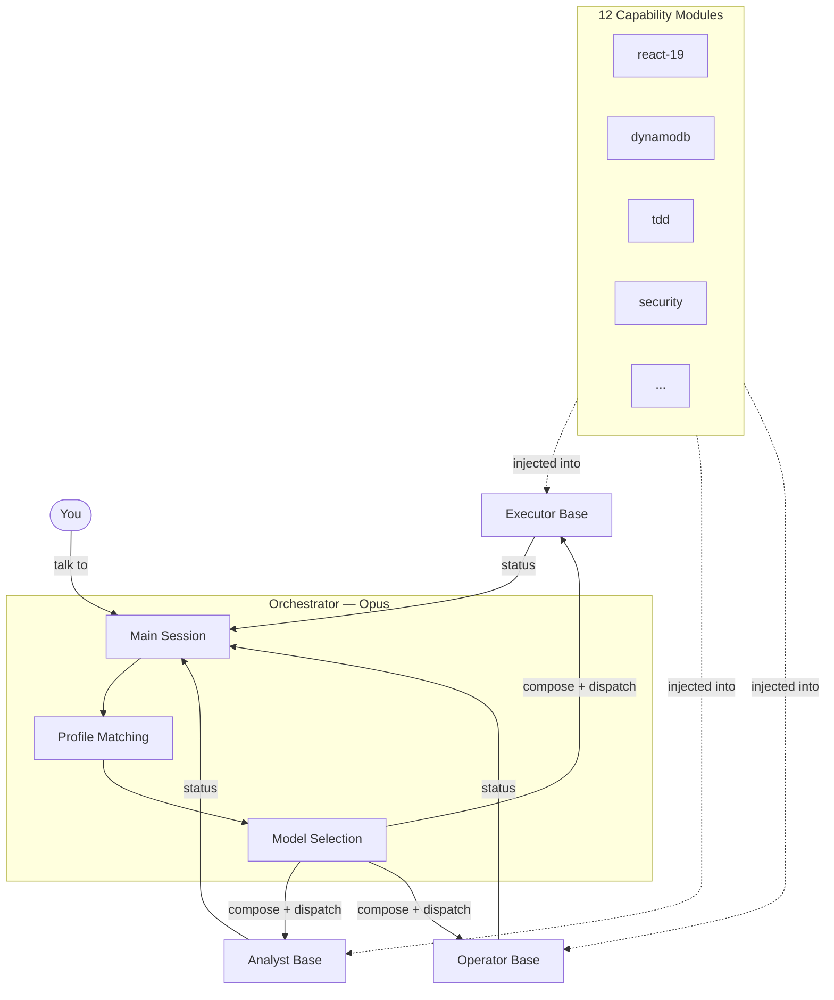
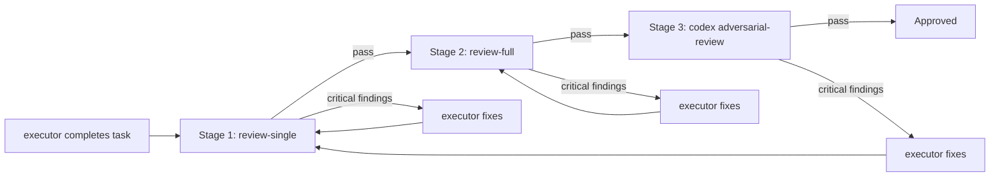

# iaGO-OS

A configuration layer for [Claude Code](https://claude.ai/code) that turns it into a structured project delivery system. Built for AI consultancies that ship client projects with Claude.

**The problem:** Claude Code starts every conversation fresh. It doesn't remember what happened last session, doesn't follow a consistent workflow, and doesn't know which client you're working on. When you're running multiple projects across a team, this becomes chaos.

**iaGO-OS fixes this** by giving Claude Code skills (reusable workflows), agents (specialized workers), hooks (automatic behaviors), and a state engine (session memory). Every conversation picks up where the last one left off, follows the same workflow, and produces consistent results.

## What Using It Looks Like

Here's a real workflow — starting a new client project from scratch:

```
# 1. Scaffold the project
./scripts/new-client.sh --name "Acme Corp" --project "dashboard" --path ../acme-dashboard

=== iaGO New Client ===
  Client:   Acme Corp (acme-corp)
  Project:  dashboard
  Template: client-project
  Target:   ../acme-dashboard

[1/5] Copying template...
[2/5] Copying hooks...
[3/5] Replacing variables...
[4/5] Creating .iago subdirectories...
[5/5] Initializing git...

=== Done ===
  Files:     23

# 2. Open Claude Code in the new project
cd ../acme-dashboard && claude
```

Now inside Claude Code:

```
# Initialize — Claude asks about your vision, constraints, and phases
> /iago:init

# Clarify the first phase — surfaces ambiguities, records decisions
> /iago:discuss phase 1

# Plan — breaks the phase into tasks with verification commands
> /iago:plan phase 1

# Execute — dispatches implementer agents, reviews each plan after
> /iago:execute phase 1

# Verify — checks every ROADMAP goal against evidence, opens a PR
> /iago:verify phase 1
```

Every session starts with context from the last one. Every skill follows the same discipline. Every agent reports with evidence, not claims.

For quick one-off tasks that don't need the full workflow:

```
> /iago:quick    # 1-3 tasks: plan, implement, review in one pass
> /iago:fast     # Trivial fix (3 files or fewer), no planning needed
```

## Prerequisites

You need these installed before using iaGO-OS. Every tool listed here is used by the stack — skip one and something will break.

| Tool | Min Version | Install | Verify |
|------|-------------|---------|--------|
| **Node.js** | 20+ | [nodejs.org](https://nodejs.org/) | `node --version` |
| **Git** | 2.30+ | [git-scm.com](https://git-scm.com/) | `git --version` |
| **Claude Code** | Latest | `npm install -g @anthropic-ai/claude-code` | `claude --version` |
| **AWS CLI** | 2.x | [AWS CLI install guide](https://docs.aws.amazon.com/cli/latest/userguide/getting-started-install.html) | `aws --version` |
| **GitHub CLI** | 2.x | [cli.github.com](https://cli.github.com/) | `gh --version` |

### Why each one matters

- **Node.js 20+** — Runtime for hooks, state engine, Lambda functions, and all build tooling (Vite, Biome, Vitest)
- **Git** — Version control, branching workflow, conventional commits enforced by hooks
- **Claude Code** — The AI coding agent that iaGO-OS configures. Everything runs inside Claude Code sessions
- **AWS CLI** — Required for Amplify Gen 2 deployments, Lambda management, DynamoDB operations, and all infra-runner agent tasks
- **GitHub CLI (`gh`)** — Used by `/iago:verify` to open PRs, and by hooks for GitHub integration

### Optional (but recommended)

| Tool | What for | Install | Verify |
|------|----------|---------|--------|
| **Codex CLI** | Cross-model review with GPT-5.4 (`/codex:*` skills) | `npm install -g @openai/codex` | `codex --version` |
| **Playwright** | E2E testing (installed per-project via npm) | `npx playwright install` | `npx playwright --version` |

### First-time setup

After installing the prerequisites:

1. **Authenticate Claude Code:** `claude` (prompts for login on first run)
2. **Authenticate AWS:** `aws configure` (needs Access Key ID, Secret Key, region)
3. **Authenticate GitHub:** `gh auth login` (follow the prompts)

## Quick Start

```bash
# 1. Clone iaGO-OS
git clone https://github.com/iagoai/iago-os.git
cd iago-os

# 2. Install skills globally (available in every Claude Code session)
./scripts/sync-skills.sh --global

# 3. Scaffold your first project
./scripts/new-client.sh --name "My Client" --project "my-app" --path ../my-app
cd ../my-app && claude
```

See [docs/SETUP.md](docs/SETUP.md) for detailed instructions (Windows + macOS).

## Skills (41)

Skills are reusable workflows you invoke with `/skill-name` inside Claude Code. Each skill knows what steps to follow, which profiles to dispatch, what artifacts to produce, and what evidence to collect before reporting done.

### Workflow — The Delivery Pipeline

These skills implement the full project lifecycle. Run them in order for structured delivery, or use the bypass modes for quick work.

| Skill | What it does | When to use | Dispatches |
|-------|-------------|-------------|------------|
| `/iago:init` | Interactive discovery — asks about vision, constraints, phases. Produces PROJECT.md, ROADMAP.md, STATE.md, config.json | Starting a new client project | `research` (optional) |
| `/iago:discuss` | Surfaces 3-5 ambiguities in a ROADMAP phase, records decisions as a context artifact | Before planning a phase — clarifies gray areas | None (interactive) |
| `/iago:plan` | Decomposes a phase into plans with 2-8 tasks each. Every task has a verification command. Self-reviews for gaps | After discuss, before execute | `research` (optional) |
| `/iago:execute` | Wave analysis, profile dispatch per plan, build gate, 3-stage review pipeline, learnings extraction. The heavy lifter | When plans exist for a phase | Matching profile + review + `/codex:adversarial-review` |
| `/iago:verify` | Goal-backward verification — checks every ROADMAP success criterion against evidence (test output, build, file existence). Opens PR if passed | After all plans in a phase are executed | None (orchestrator-direct) |
| `/iago:quick` | One-shot path: lightweight plan → matching profile → review-single → done. Composable flags: `--discuss`, `--research`, `--verify` | Small standalone task (1-3 tasks) outside a ROADMAP phase | Matching profile + `review-single` |
| `/iago:fast` | Inline execution with atomic commit. No planning, no agents, no review | Trivial fix — 3 files or fewer, obvious change | None (inline) |
| `/iago:pause` | Writes HANDOFF.json with workflow position, completed tasks, next action. Next session auto-resumes | Switching context, ending day, hitting a blocker | None |

### Workflow — Project Setup

| Skill | What it does | When to use |
|-------|-------------|-------------|
| `/iago:scaffold` | Creates a new project directory from the iaGO template (React 19 + Vite + TS + Tailwind + ShadCN + AWS Amplify Gen 2). Copies hooks, replaces template variables, inits git | Starting a greenfield client project |
| `/iago:proposal` | Generates a structured client proposal: scope, timeline, cost estimate, technical approach, deliverables. Dispatches `content` profile for prose quality | Pre-engagement — scoping a new client |
| `/iago:onboard` | Scans an existing codebase (directory structure, package.json, configs), produces architecture map and tech debt inventory, populates PROJECT.md | Onboarding an existing repo into iaGO workflow |
| `/iago:n8n` | Designs n8n automation workflow specs: node configs, trigger definitions, data flow diagrams, IAM policies | Designing webhook/event-driven automations |
| `/iago:agents` | Designs multi-agent architectures: agent roles, tool schemas, LangGraph state graphs, orchestration patterns | Designing agent systems for client deliverables |

### Core — Design, Plan, Build, Review, Research

| Skill | What it does | When to use | Dispatches |
|-------|-------------|-------------|------------|
| `/brainstorming` | Socratic design exploration — asks questions, maps trade-offs, writes a spec to `docs/specs/` | Starting a new feature or architecture decision | None (interactive) |
| `/writing-plans` | Breaks an approved spec into 2-5 min tasks organized into parallel execution waves. Every task has a verify command | After brainstorming produces a spec | None (planning only) |
| `/subagent-driven-development` | Executes a plan by dispatching a fresh profile per task. No cross-task state leakage. Mandatory Codex adversarial review after internal review | Executing a multi-task implementation plan | Matching profile + review + `/codex:adversarial-review` |
| `/code-review` | Dispatches review profile against a git diff. Produces severity-categorized findings (Critical/Important/Minor). Anti-performative-agreement rules prevent empty "LGTM" | After implementation, before merge | `review-single` or `review-full` + `/codex:adversarial-review` |
| `/deep-research` | Multi-source research (codebase + context7 docs + web). Produces an actionable recommendation document in `docs/research/` | Research question that goes beyond the codebase | `research` |
| `/prompt-optimizer` | Analyzes, rewrites, and tests LLM prompts for client-facing features. Recommends model tier. Output to `docs/prompts/` | Building or tuning chatbot/agent/classifier prompts | None (inline) |

### Content — Articles, Investor Materials, Presentations

| Skill | What it does | Dispatches |
|-------|-------------|------------|
| `/article-writing` | Blog posts and thought leadership with authoritative consulting voice. Tone/length/audience flags | `content` |
| `/content-engine` | Transforms one source into blog + social (Twitter, LinkedIn, Threads) + newsletter + summary | `content` |
| `/investor-materials` | Pitch deck outlines, one-pagers, executive summaries with data-driven narratives | `content` |
| `/investor-outreach` | Personalized investor emails and follow-up sequences tailored to each investor's thesis | None (inline) |
| `/market-research` | Market sizing, competitive landscape, trend identification for proposals or strategy | None (inline) |
| `/visa-doc-translate` | Visa/immigration document translation with legal terminology and consulate conventions | None (inline) |
| `/frontend-slides` | Presentation slide content for React 19 + TailwindCSS 4 rendering or Marp markdown | None (inline) |

### Experimental — Advanced Patterns

| Skill | What it does |
|-------|-------------|
| `/autonomous-loops` | Bounded autonomous work with safety rails (max iterations, cost ceiling, verify interval) |
| `/continuous-agent-loop` | Persistent agent that watches for changes, reacts to events, checkpoints state |
| `/enterprise-agent-ops` | Production-grade multi-agent architecture design (3-5 agents, topology, runbooks) |
| `/agent-payment-x402` | Agent-to-agent payment flows via x402 HTTP payment protocol |
| `/liquid-glass-design` | Glassmorphism and liquid glass UI effects with TailwindCSS 4 + ShadCN/UI |
| `/santa-method` | SANTA decomposition (Situation, Actors, Needs, Tensions, Actions) for ambiguous problems |

### Industry — Domain-Specific Pattern Libraries

Advisory skills that provide DynamoDB schemas, API patterns, and compliance guidance for vertical industries.

| Skill | Domain | Covers |
|-------|--------|--------|
| `/healthcare-phi-compliance` | Healthcare | HIPAA encryption, access controls, audit logging, BAA requirements |
| `/carrier-relationship-management` | Logistics | Carrier profiles, rate tables, lane pricing, performance scorecards |
| `/customs` | Trade | HTS classification, duty calculation, export controls, denied party screening |
| `/energy` | Energy | Meter data ingestion, grid events, energy trading, demand response |
| `/logistics` | Supply chain | Shipment lifecycle, route optimization, warehouse operations, carrier APIs |
| `/inventory` | Warehousing | Stock tracking, reorder points, multi-location transfers, cycle counting |
| `/production-scheduling` | Manufacturing | Work orders, resource allocation, shift planning, capacity constraints |
| `/quality-nonconformance` | Quality | Inspections, defect classification, CAPA workflows, root cause analysis |
| `/returns-reverse-logistics` | Returns | RMA creation, return shipping, disposition, refund processing |

Full reference with triggers, arguments, and code examples: [docs/SKILLS.md](docs/SKILLS.md)

## Agent Architecture

### Hub-and-Spoke

iaGO-OS uses a hub-and-spoke model. Your main Claude Code session is the **orchestrator** (Opus) — it plans, reasons, and dispatches work. Agents are **capability-based**: each task is matched to a profile, the orchestrator selects a model, composes the prompt from a base + capability modules + learnings, and dispatches. Agents never spawn other agents, and they never talk to each other. All coordination flows through the orchestrator.



Every agent ends its response with exactly one of four statuses — no ambiguity about whether work is finished.

### Tool Sandboxing

Each base gets only the tools appropriate for its role. This prevents accidents and keeps agents focused:

| Base | Can read | Can write | Can run commands | Can search web |
|------|----------|-----------|-----------------|----------------|
| `executor` | Yes | Yes | Yes | No |
| `analyst` | Yes | No | Yes (diagnostics) | No |
| `operator` | Yes | No | Yes | Yes |

Analysts can't edit files. Executors can't search the web. This is by design.

### Review Pipeline

Code review has two modes depending on the config (`review.mode` in `.iago/config.json`):

**Single-pass** (default for `/iago:quick`): The `review-single` profile does one pass — correctness, security, standards.

**Full** (default for `/iago:execute`): Three-stage pipeline:



1. **Stage 1 — Spec review:** `review-single` checks if the implementation matches the plan
2. **Stage 2 — Quality review:** `review-full` checks performance, security, maintainability
3. **Stage 3 — Cross-model (mandatory):** `/codex:adversarial-review` sends every diff to GPT-5.4 — a different model catches different blind spots

If any stage returns Critical findings, the orchestrator routes back to the executor for fixes before proceeding.

### Capability Modules (13)

Domain knowledge injected into agent prompts at dispatch time. Each module is a markdown file in `.claude/agents/capabilities/`:

| Capability | What it teaches the agent |
|-----------|--------------------------|
| `react-19` | `use()` + Suspense data fetching, ShadCN/UI patterns, TanStack Query, concurrent UI |
| `animation` | Framer Motion, GSAP + ScrollTrigger, Lenis smooth scroll, integration rules, a11y |
| `dynamodb` | Single-table design, access patterns, GSI strategy, batch operations, TTL |
| `lambda` | Thin handler pattern, cold start mitigation, ESM, environment config |
| `cognito` | JWT validation in API Gateway, token refresh, custom attributes, pre-signup triggers |
| `tdd` | RED-GREEN-REFACTOR cycle, rationalization prevention, coverage rules |
| `security` | OWASP Top 10, AWS-specific checks, hardcoded secrets, CORS, tenant isolation |
| `e2e` | Playwright selectors, `data-testid`, Page Object Model, auth via `storageState` |
| `review-spec` | Plan compliance verification — file paths, actions, tests, no deviations |
| `review-quality` | Performance, TypeScript strictness, maintainability, React/DynamoDB conventions |
| `content` | Consulting voice, multi-format output, channel adaptation, no filler |
| `infra` | AWS CLI, Amplify Gen 2, CDK, IAM, deployment patterns |
| `forms` | React Hook Form + Zod, ShadCN Controller integration, server error mapping |

### Agent Profiles (12)

Pre-composed base + capability combinations. The orchestrator selects the right profile based on file paths and task description.

| Profile | Base | Capabilities | Model | When dispatched |
|---------|------|-------------|-------|-----------------|
| `fullstack` | executor | react-19, dynamodb, lambda, tdd, forms, animation | auto | Task touches both `src/` and `amplify/` (also the fallback) |
| `frontend` | executor | react-19, tdd, forms, animation | auto | Task only touches `src/` — no backend changes |
| `backend` | executor | dynamodb, lambda, cognito, tdd | auto | Task only touches `amplify/` — no frontend changes |
| `review-single` | analyst | security, review-spec, review-quality | auto | Default review after implementation (`review.mode: "single"`) |
| `review-full` | analyst | security, review-spec, review-quality | auto | Two-stage gated review (`review.mode: "full"`) — Stage 1 must pass before Stage 2 |
| `security-audit` | analyst | security, cognito, review-quality | opus | Auth, payment, or data-access changes — always Opus, never downgraded |
| `research` | operator | dynamic (context-dependent) | sonnet | `/deep-research`, `--research` flag on plan/quick skills |
| `e2e` | executor | e2e, react-19 | sonnet | Writing or updating Playwright E2E tests |
| `infra` | operator | infra | sonnet | AWS CLI, Amplify deployments, CDK operations |
| `schema` | analyst | dynamodb | sonnet | DynamoDB single-table design, access pattern analysis |
| `content` | operator | content | sonnet | Articles, proposals, investor materials, outreach |
| `debug` | executor | dynamic (context-dependent) | auto | Build/typecheck/lint failures — capabilities selected based on error context |

## Hooks (10)

Hooks are automatic behaviors wired in `.claude/settings.json`. They fire on Claude Code lifecycle events — you never invoke them manually.

### Context & State

| Hook | Fires on | What it does | Why it matters |
|------|----------|-------------|----------------|
| `context-persistence` | Session start, pre-compact, stop | Saves a session snapshot before context compression. Restores the previous session's state on startup. Loads HANDOFF.json if `/iago:pause` was used | Every conversation picks up where the last one left off — no re-explaining the project |
| `context-monitor` | After every tool use | Reads the bridge file to check context window fill level. Warns at 70% and 90% thresholds with suggested actions (compact, pause, finish current task) | Prevents losing work to unexpected context limit hits |
| `usage-tracker` | After skill/agent use, session stop | Logs every skill invocation and agent dispatch to `.iago/state/usage-log.jsonl`. Writes a session summary at stop (duration, skills used, agents dispatched) | Feeds the usage report script and future dashboard |

### Safety & Quality

| Hook | Fires on | What it does | Why it matters |
|------|----------|-------------|----------------|
| `safety-guard` | Before bash, edit, write | Blocks commands that could leak secrets (`env`, `printenv`, `.env` reads), destructive operations (`rm -rf`, `drop table`), and disk-level writes | Prevents accidental damage to the project or credential exposure |
| `config-protection` | Before edit, write | Blocks changes that weaken Biome, TypeScript, or linter configs (disabling rules, loosening `strict`, adding `skipLibCheck`) | Config drift is how code quality erodes — this stops it at the source |
| `commit-quality` | Before bash (git commit) | Validates conventional commit format: type prefix required, subject under 72 chars, no WIP on main | Enforces clean git history without relying on developer discipline |

### Post-Edit Pipeline

| Hook | Fires on | What it does | Why it matters |
|------|----------|-------------|----------------|
| `post-edit-format` | After file edit | Runs `npx biome format --write` on the edited file | Every edit is auto-formatted — no style debates, no format commits |
| `post-edit-typecheck` | After TS/TSX edit | Runs `npx tsc --noEmit` on the edited file and reports type errors immediately | Type errors caught in seconds, not after a full build |
| `post-edit-console-warn` | After file edit | Scans the edited file for `console.log` and warns if found in production code paths | `console.log` in production is a code smell — catch it before review |

### Display

| Hook | Fires on | What it does | Why it matters |
|------|----------|-------------|----------------|
| `statusline` | Continuous | Outputs git branch, context window %, active client slug, and session duration. Writes a bridge file for `context-monitor` | At-a-glance session status without running commands |

## Ecosystem Integrations

iaGO-OS builds on top of Claude Code's native capabilities and third-party plugins. These aren't custom — they ship with Claude Code or are installed separately — but they're wired into the workflow.

### Claude Code Native Skills

These come built into Claude Code. No installation needed.

| Skill | When to use |
|-------|-------------|
| `/simplify` | After implementation — reviews changed code for reuse and quality, then fixes issues |
| `/loop` | Recurring checks — e.g., `/loop 5m /codex:status` to poll a background job |
| `/schedule` | Cron-scheduled remote agents — automated tasks that run on a schedule |
| `/claude-api` | When building apps with the Claude API, Anthropic SDK, or Agent SDK |

### Codex Plugin (Cross-Model)

Uses GPT-5.4 via the Codex CLI for a second opinion from a different model family. Useful for catching blind spots that a single-model review might miss.

| Skill | When to use |
|-------|-------------|
| `/codex:review` | Read-only code review against git changes — GPT-5.4 perspective |
| `/codex:adversarial-review` | **Mandatory** cross-model review on every plan — auth, data loss, race conditions, business logic |
| `/codex:rescue` | Delegate debugging or implementation to Codex in background |
| `/codex:status` | Check active and recent Codex background jobs |
| `/codex:result` | Retrieve output from a finished Codex job |
| `/codex:cancel` | Cancel an active background job |
| `/codex:setup` | Check Codex CLI readiness and manage the review gate |

Requires the Codex CLI installed separately. See `/codex:setup` to verify.

### MCP Servers

[Model Context Protocol](https://modelcontextprotocol.io) servers give Claude access to external data sources during sessions.

| Server | What it provides | When to use |
|--------|-----------------|-------------|
| `context7` | Live library/framework documentation | Always prefer over web search for API syntax, setup, version migration (React, Tailwind, ShadCN, AWS SDK, etc.) |
| `obsidian` | Read/write access to an Obsidian vault | Knowledge base operations — notes, tags, frontmatter |

Configured in `.claude/settings.json` under `mcpServers`.

### Model Routing

Not all work needs the same model. iaGO-OS routes tasks by complexity:

| Model | Role | Used by |
|-------|------|---------|
| **Opus** | Orchestrator — planning, architecture, multi-file reasoning | Your main Claude Code session |
| **Sonnet** | Worker — implementation, review, research, debugging | Default for all agent profiles |
| **Haiku** | Mechanical — formatting, simple lookups | Reserved for lightweight tasks |
| **Codex (GPT-5.4)** | Cross-model — mandatory adversarial review on every plan, rescue delegation | `/codex:*` skills |

## Folder Structure

```
iago-os/
  .claude/
    settings.json            # Hook wiring
    skills/                  # 41 skill definitions (SKILL.md each)
    agents/                  # 3 bases + 13 capabilities + 12 profiles
      executor.md
      analyst.md
      operator.md
      capabilities/          # 13 capability modules
      profiles/              # 12 agent profiles
    rules/                   # 8 behavioral rules (TDD, debugging, git, etc.)
  .iago/
    hooks/                   # 10 hooks (context, safety, formatting, tracking)
      lib/                   # Shared utilities (stdin, flags, state-manager)
    state/                   # Runtime state (sessions, usage log)
  templates/
    client-project/          # Client project template
    internal-project/        # Internal project template
  scripts/
    new-client.sh/.ps1       # Scaffold new project from template
    sync-skills.sh/.ps1      # Sync skills/agents/rules to project or globally
    usage-report.sh/.ps1     # Usage analytics from JSONL telemetry
  docs/
    SETUP.md                 # First-time setup guide
    ARCHITECTURE.md          # How it works under the hood
    SKILLS.md                # Full skill reference catalog
    WORKFLOW.md              # Workflow phases explained
    IAGO-DASHBOARD.md        # Future dashboard vision
  CLAUDE.md                  # Root config — stack, standards, workflow
  HANDOFF.md                 # Current project state
```

## Tech Stack

Projects built with iaGO-OS use this stack (configurable per project):

- **Frontend:** React 19 + Vite + TypeScript (strict) + TailwindCSS 4 + ShadCN/UI + Framer Motion + GSAP/ScrollTrigger + Lenis
- **Backend:** AWS Amplify Gen 2 + Lambda + API Gateway + DynamoDB + Cognito + SES
- **Agents:** Claude SDK (Anthropic) + LangGraph + n8n
- **Testing:** Vitest (unit/integration), Playwright (E2E)
- **Tooling:** Biome (formatter + linter)

## Documentation

- [SETUP.md](docs/SETUP.md) — First-time setup (Windows + macOS)
- [ARCHITECTURE.md](docs/ARCHITECTURE.md) — How iaGO-OS works under the hood
- [SKILLS.md](docs/SKILLS.md) — Full skill reference catalog
- [WORKFLOW.md](docs/WORKFLOW.md) — Workflow phases explained

## License

Proprietary. Copyright iaGO AI.
