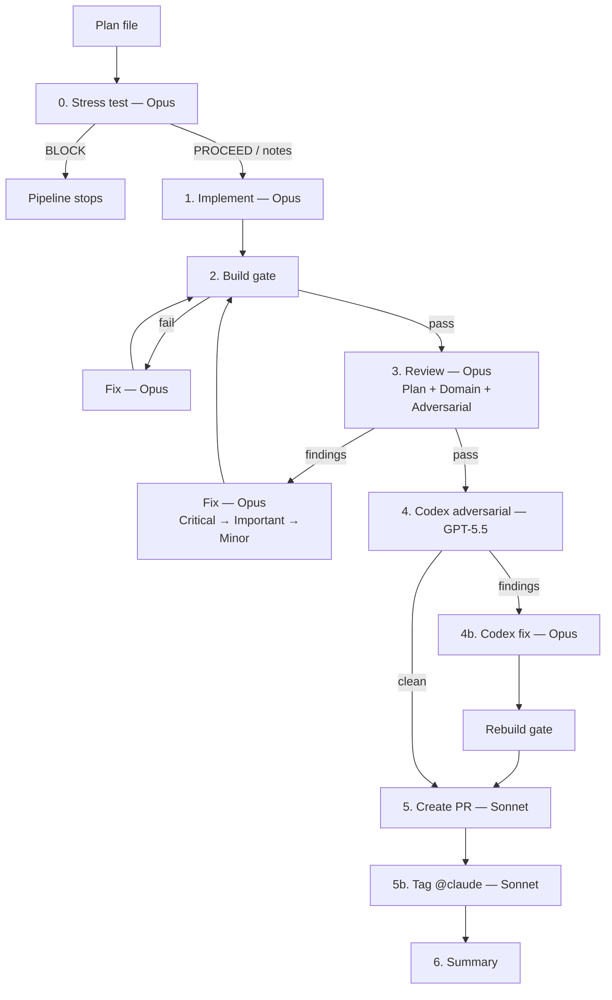
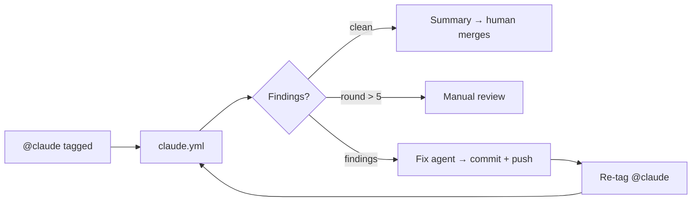

# iaGO-OS

<div align="center">


**A multi-agent operating system, controlled from your phone.**

*Hosts agents of any execution shape on a VPS. Ships client work through a hardened review pipeline. Built by the system itself.*

</div>

---

## What this is

**iaGO-OS is a multi-agent OS** that hosts agents of any execution shape — PTY-based CLI runtimes (Claude Code, Codex, Gemini, opencode), HTTP/SDK programs, MCP-as-agent servers, webhook/event workers, long-running daemons — on a Hostinger VPS reached over Tailscale, controlled from a phone via Telegram, observed through a web dashboard.

It is also the delivery system we use to ship our own client work and to build itself: a Claude Code configuration layer of 37 skills, 12 agent profiles, 8 hooks, and a cross-model review pipeline that gets fresh `claude -p` sessions to plan → implement → build → review → ship under discipline.

> **Two layers, one repo.** The OS (v2) runs on the VPS. The delivery pipeline (v1, still the moat) runs locally and in CI. The OS uses the pipeline to build itself.

**Who it's for:** Our 3-person AI consultancy (iaGO) and any team that wants to make Claude Code into a real delivery system rather than a blank-slate chatbot.

---

## The 5 layers

| # | Layer | What | Tech |
|---|---|---|---|
| 1 | **Runtime substrate** | Hostinger VPS + Tailscale mesh + systemd | OS-native, no Docker |
| 2 | **Agent execution** | Daemon hosting `AgentRuntime` adapters across 5 shapes; file-bus coordination; crash markers + auto-restart; `session.jsonl` replay; heartbeat health; subagent semantics | Node 20 + TypeScript strict + JSON/SQLite |
| 3 | **Control plane** | Telegram-primary phone control (start/stop/inject/approve/abort); file-based approval handshake; cross-runtime event router | Telegram Bot API + file-bus |
| 4 | **Dashboard** | Live agent state across all shapes, token spend per agent/project/model, intervention controls; same-host IPC, not REST | Next.js + Unix socket IPC |
| 5 | **Pipeline (preserved)** | Cross-model Codex review, severity floors, secret-exclusion staging, skill routing, stress test — *this is the moat* | `claude -p` + Codex CLI + GitHub Actions |


---

## What's shipped — what's in flight

**As of 2026-05-19:**

| Phase | Scope | Status |
|---|---|---|
| **Phase 0** | Strategic validation + canonical v2 vision lock | Shipped |
| **Phase 1** | Daemon skeleton (`runtime/`) — `AgentRuntime` interface, registry, `claude-pty` adapter (Shape 1), file-bus, IPC, `session.jsonl` two-phase replay, heartbeat, Telegram approval handshake, hello-world end-to-end | Shipped, local-only on Windows |
| **Phase 2** | VPS bootstrap + OpenClaw cutover. systemd unit, credential bootstrap, WhatsApp deauth + Telegram rotation, PR-triage agent (04a), cutover/rollback scripts + dry-run harness (03a). Cutover scheduled **Sunday 2026-05-25 20:00 US/Mexico** | 7/12 plans merged; 04b · 05a · 05b · 06 · 07a remaining |
| **Phase 3+** | Additional PTY adapters (Codex, Gemini, opencode), HTTP/SDK shape, MCP-as-agent shape, full Next.js dashboard, cost ledger (SQLite), Hermes pre-LLM cron wake gate, shell-hook router | Planned |

The pipeline runs every plan through 0. Stress → 1. Implement → 2. Build gate → 3. Review (plan + domain + adversarial) → 4. Codex adversarial → 4b. Codex fix → 5. PR → 5b. @claude tag → 6. Summary. Each stage is a fresh `claude -p` session.

---

## Quick start

```bash
# 1. Clone
git clone https://github.com/ilsantino/iago-os.git && cd iago-os

# 2. Install skills + agents globally
./scripts/sync-skills.sh --global

# 3. (Optional) install the memory stack — MemPalace + Graphify
bash scripts/setup-memory.sh        # macOS / Linux / Git Bash
.\scripts\setup-memory.ps1          # Windows PowerShell

# 4. Scaffold a client project
./scripts/new-client.sh --name "My Client" --project "my-app" --path ../my-app

# 5. Start working
cd ../my-app && claude
```

Inside Claude Code on a client project:

```
> /iago-init                    # Discovery → PROJECT.md + ROADMAP.md
> /iago-discuss phase 1         # Clarify ambiguities → context artifact
> /iago-plan phase 1            # Decompose → plan files (with stress test)
> /iago-execute phase 1         # Pipeline → build → review → PR
> /iago-verify phase 1          # Goal verification → ship or re-plan
```

Bypass modes:

```
> /iago-quick "Add email validation to the form"   # 1-3 tasks, full pipeline
> /iago-fast  "Fix typo in login button"           # Inline, build gate only
> /iago-prfix                                      # Auto-fix PR review comments
```

See [docs/SETUP.md](docs/SETUP.md) for the full Windows + macOS install.

---

## Working on the OS itself

The `runtime/` directory is the v2 daemon. It is a separate Node 20 + TypeScript-strict project with its own `package.json` and test suite.

```bash
cd runtime
npm install
npm test            # Vitest unit + integration
npm run typecheck   # tsc --noEmit
npm run lint        # biome check .
```

Phase 1 ships **Shape 1 (PTY) only** via the `claude-pty` adapter. The polymorphic `AgentRuntime` interface, registry, file-bus, IPC, session-log, heartbeat, and Telegram approval handshake are all live. Cutover from OpenClaw to v2 on the VPS lands Sunday 2026-05-25.

**Local-only today, VPS Sunday.** See [`runtime/README.md`](runtime/README.md) for the adapter authoring guide and [`docs/specs/iago-os-v2-vision.md`](docs/specs/iago-os-v2-vision.md) for the full 5-shape taxonomy and phase sequencing.

---

## Choosing the right mode

| | `/iago-execute` | `/iago-quick` | `/iago-fast` | `/iago-prfix` |
|---|---|---|---|---|
| **Plans** | Uses existing | Creates on-the-fly | None | None |
| **Pipeline** | Full 8-stage | Full 8-stage | Build gate only | GitHub Action loop |
| **Review** | Plan + adversarial + Codex + fix | Plan + adversarial + Codex + fix | None | Async (up to 5 rounds) |
| **Scope** | Phase (2+ plans) | 1-3 tasks | ≤3 files | Existing PR |
| **PR** | Yes (per plan) | Yes | No | Fixes existing |
| **Time** | 30-60 min/plan | 10-20 min | < 1 min | Async |

---

## The delivery pipeline

Every plan goes through `scripts/execute-pipeline.sh`. Each step is a fresh `claude -p` session — isolated context, no token burn in the orchestrator. Findings are fixed locally before PR creation; the async GitHub loop is a safety net.

| Step | Model | What it does |
|------|-------|-------------|
| **0. Stress test** | Opus | Adversarial review of the plan itself — precision, edge cases, contradictions, simpler alternatives. Skipped if plan has a `## Stress Test` section. |
| **1. Implement** | Opus | Reads plan + stress-test findings. Max 50 turns. |
| **2. Build gate** | — | `tsc --noEmit && vite build`. Max 2 retries with fix sessions. Skipped for config-only repos. |
| **3. Review** | Opus | Three-pass: plan compliance + domain routing (selects from 11 check modules) + adversarial (auth bypass, data loss, races, rollback). Severity floors enforced. Max 2 fix rounds. |
| **4. Codex adversarial** | GPT-5.5 / Opus fallback | Cross-model review with plan context. `codex-companion adversarial-review` bypasses the Codex sandbox so it runs identically on Windows / Mac / Linux. |
| **4b. Codex fix** | Opus | Fixes all Codex findings (P0 → P1 → P2) + rebuild gate. Skipped if clean. |
| **5. Create PR** | Sonnet | Stages, commits, pushes, opens PR via `gh`. |
| **5b. Tag @claude** | Sonnet | Synthesizes context-rich review request from plan + diff. Triggers async loop. |
| **6. Summary** | — | Writes results to `.iago/summaries/`. |



### Async review-fix loop (GitHub Actions)

Triggered by the @claude tag on the PR. `claude.yml` reviews → posts findings. `claude-review-fix.yml` fixes → commits → re-tags. Loops until clean or max 5 rounds. **Humans merge — the loop never auto-merges.**



---

## Agent architecture

Hub-and-spoke. The main session is the **orchestrator** (Opus). It plans, reasons, and dispatches. Profiles are pre-composed `base + capabilities`; agents never spawn other agents.

| Base | Read | Write | Run commands | Web |
|---|---|---|---|---|
| `executor` | ✓ | ✓ | ✓ | — |
| `analyst` | ✓ | — | ✓ (diagnostics) | — |
| `operator` | ✓ | — | ✓ | ✓ |

| Model | Role | Used by |
|---|---|---|
| **Opus** | Planning, implementation, debugging | Orchestrator + executor profiles |
| **Sonnet** | Analysis, PR creation, @claude tags, research | Analyst / operator profiles |
| **Codex (GPT-5.5)** | Cross-model adversarial review | `/codex:*` skills (falls back to Claude if unavailable) |

---

<details>
<summary><h2>Skills (37)</h2></summary>

Invoked with `/skill-name`. Each skill knows what to do, which profiles to dispatch, and what evidence to collect.

### Workflow — delivery pipeline

| Skill | What | Dispatches |
|---|---|---|
| `/iago-init` | Interactive discovery → PROJECT.md, ROADMAP.md, STATE.md | `research` (optional) |
| `/iago-discuss` | Surfaces ambiguities in a phase, records decisions | None |
| `/iago-plan` | Decomposes phase into plans with stress test | `research` (optional) |
| `/iago-execute` | Full pipeline: agent dispatch → build → review → PR | Profile + review + Codex |
| `/iago-stress` | Adversarial stress test on a plan. `--deep` for council-style multi-lens | `analyst` (opus) |
| `/iago-verify` | Goal-backward verification, opens PR if passed | None |
| `/iago-quick` | One-shot: plan + full pipeline | Pipeline |
| `/iago-fast` | Inline edit + atomic commit. No agents, no review | None |
| `/iago-prfix` | Fixes PR review comments, pushes, re-tags | Matching profile per fix |
| `/iago-pause` | Writes HANDOFF.json for session resume | None |

### Project setup

| Skill | What |
|---|---|
| `/iago-scaffold` | New client project (React 19 + Vite + TS + Tailwind + ShadCN + Amplify Gen 2) |
| `/iago-proposal` | Client proposal: scope, timeline, cost, tech approach |
| `/iago-onboard` | Scan existing codebase → architecture map → PROJECT.md |
| `/iago-n8n` | Design n8n automation workflow specs |
| `/iago-agents` | Design multi-agent architectures (Claude SDK + LangGraph) |
| `/iago-schedule` | Install recurring automation triggers |

### Core — design, plan, build, review, research

| Skill | What | Dispatches |
|---|---|---|
| `/brainstorming` | Socratic design exploration → spec in `docs/specs/` | None |
| `/writing-plans` | Break spec into 2-5 min tasks with verify commands | None |
| `/subagent-driven-development` | Execute plan with fresh profile per task. `--pipeline` for 8-stage isolation | Profile + review + Codex |
| `/code-review` | Severity-categorized findings (Critical / Important / Minor) | `review-single` / `review-full` |
| `/deep-research` | Multi-source research → recommendation doc | `research` |
| `/council` | 5-advisor council (Karpathy pattern) — independent analysis + anonymous peer review + synthesis | `analyst` × 5 + chairman |
| `/prompt-optimizer` | Analyze, rewrite, test LLM prompts | None |

### Content / experimental / industry / audit

Full reference in [.claude/rules/available-skills.md](.claude/rules/available-skills.md). Categories: content (5), experimental (5), industry (2), audit deep-sweep (2), Codex (6), Claude Code native (4).

</details>

<details>
<summary><h2>Agent profiles (12)</h2></summary>

Pre-composed `base + capabilities`. The orchestrator selects by file path + task description.

| Profile | Base | Capabilities | Model | When dispatched |
|---|---|---|---|---|
| `fullstack` | executor | react-19, dynamodb, lambda, tdd, forms, animation | opus | Touches both `src/` and `amplify/` |
| `frontend` | executor | react-19, tdd, forms, animation | opus | Only `src/` |
| `backend` | executor | dynamodb, lambda, cognito, tdd | opus | Only `amplify/` |
| `review-single` | analyst | security, review-spec, review-quality | sonnet | Default review |
| `review-full` | analyst | security, review-spec, review-quality | sonnet | Two-stage gated review |
| `security-audit` | analyst | security, cognito, review-quality | opus | Auth / payment / data — always Opus |
| `research` | operator | dynamic | sonnet | `/deep-research`, `--research` flag |
| `e2e` | executor | e2e, react-19 | opus | Playwright tests |
| `infra` | operator | infra | sonnet | AWS CLI, Amplify deployments |
| `schema` | analyst | dynamodb | sonnet | DynamoDB schema design |
| `content` | operator | content | sonnet | Articles, proposals, outreach |
| `debug` | executor | dynamic | opus | Build / typecheck / lint failures |

</details>

<details>
<summary><h2>Hooks (8)</h2></summary>

Wired in `.claude/settings.json`. Fire on Claude Code lifecycle events.

| Hook | Fires on | What it does |
|---|---|---|
| `context-persistence` | Session start, pre-compact, stop | Saves/restores session state. Loads `HANDOFF.json` from `/iago-pause` |
| `usage-tracker` | After skill/agent use, stop | Logs invocations to `.iago/state/usage-log.jsonl` |
| `safety-guard` | Before bash, edit, write | Blocks secret leaks, destructive ops |
| `config-protection` | Before edit, write | Blocks weakening of Biome/TypeScript/linter configs |
| `commit-quality` | Before git commit | Validates conventional commit format |
| `post-edit-format` | After file edit | `npx biome format --write` on edited file |
| `post-edit-typecheck` | After TS/TSX edit | `npx tsc --noEmit` with immediate error reporting |
| `post-edit-console-warn` | After file edit | Warns on `console.log` in production code |

</details>

---

## Memory stack (optional)

Adds persistent cross-session memory. Not required — iaGO-OS works without it.

```bash
bash scripts/setup-memory.sh        # macOS / Linux / Git Bash
.\scripts\setup-memory.ps1          # Windows PowerShell
```

**Requires:** Python 3.10+.

| Layer | What | Access |
|---|---|---|
| **MemPalace** | Semantic search over all past conversations. Auto-writes a diary at session end | `mempalace_search`, `mempalace_diary_read` (MCP) |
| **Graphify** | Knowledge graph + navigable wiki over any document corpus (Obsidian vault, Drive, project files) | `query_graph`, `get_node` (MCP) + static wiki |

Full architecture and retrieval routing in the **Memory Architecture** section of [CLAUDE.md](CLAUDE.md).

---

## Ecosystem integrations

### Codex (cross-model)

GPT-5.5 via Codex CLI for a second opinion from a different model family. Each operator pins their model in `~/.codex/config.toml`:

```toml
model = "gpt-5.5"
model_reasoning_effort = "high"
```

Requires Codex CLI ≥ 0.125.0. GPT-5.5 is currently ChatGPT-sign-in only during rollout.

| Skill | What |
|---|---|
| `/codex:adversarial-review` | Mandatory cross-model review on every plan |
| `/codex:review` | Read-only GPT-5.5 code review |
| `/codex:rescue` | Delegate debugging/implementation to Codex in background |
| `/codex:status` / `/codex:result` / `/codex:cancel` | Manage background Codex jobs |

### MCP servers

| Server | What | Setup |
|---|---|---|
| `context7` | Live library/framework docs | Built-in |
| `obsidian` | Read/write access to Obsidian vault | Built-in |
| `markitdown` | DOCX, PPTX, XLSX, EPub, large PDFs, YouTube → markdown | Global install |
| `youtube-transcript` | YouTube transcripts via InnerTube | Global install |
| `mempalace` | Semantic search over conversation history + agent diary | `setup-memory.sh` |
| `graphify` | Knowledge graph queries | `setup-memory.sh` |

---

## Folder structure

```
iago-os/
  runtime/                  # v2 daemon (Node 20 + TS strict — separate project)
    agent-runtime/
      registry.ts           # AgentRuntime polymorphic interface + module-scope registry
      types.ts              # AgentShape, AgentHandle, AgentMessage, SpawnOpts...
      pty/claude-pty.ts     # Shape 1 (PTY) — Phase 1 reference adapter
    daemon/                 # agent-manager, file-bus, IPC server, session-log, heartbeat, cron stub
    telegram/               # approval handshake + per-agent file-bus tagging
    deploy/                 # systemd unit, cutover.sh, rollback.sh, test-cutover.mjs
    migration/              # Per-phase audit + rollback docs
    integration/            # End-to-end Vitest harness (hello-world flow)

  .claude/
    settings.json           # Hook wiring
    skills/                 # 37 skill definitions
    agents/                 # 3 bases + 13 capabilities + 12 profiles
    rules/                  # 8 behavioral rules (TDD, debugging, git, execution-pipeline...)

  .iago/                    # Workflow artifacts
    plans/                  # Per-phase / per-feature plan files
    summaries/              # Pipeline run summaries
    reviews/                # Per-PR Opus + Codex review artifacts
    runs/                   # Per-wave dispatch logs
    decisions/              # ADRs
    learnings/              # Accumulated review patterns
    hooks/                  # 8 hooks + shared lib
    state/                  # Runtime state (sessions, usage log)
    STATE.md                # Always-loaded digest
    CONTEXT.md              # L2 stage contract

  .github/workflows/
    claude.yml              # PR review via Claude Code Action
    claude-review-fix.yml   # Async review-fix loop

  scripts/
    execute-pipeline.sh     # 8-stage cross-session review pipeline
    review-checks/          # 11 review modules (baseline, amplify, api, auth, backend,
                            #   data-integrity, i18n, infra, patterns, react, shell-deploy)
    new-client.sh / .ps1    # Scaffold new client project
    sync-skills.sh / .ps1   # Sync skills to project or globally
    setup-memory.sh / .ps1  # Install MemPalace + Graphify
    lib/                    # Shared bash + node helpers

  templates/
    client-project/         # Client project template
    internal-project/       # Internal project template
    memory/                 # Memory stack configs

  docs/
    ARCHITECTURE.md         # How iaGO-OS works under the hood
    SETUP.md                # First-time setup (Windows + macOS)
    MANUAL.md               # Complete usage manual
    WORKFLOW.md             # Phase flow, state transitions, artifact locations
    specs/                  # Vision specs, ADRs, feature specs (iago-os-v2-vision.md is canonical)

  CLAUDE.md                 # Root config — stack, standards, workflow
```

---

## Prerequisites

| Tool | Min version | Install | Verify |
|---|---|---|---|
| **Node.js** | 20+ | [nodejs.org](https://nodejs.org/) | `node --version` |
| **Git** | 2.30+ | [git-scm.com](https://git-scm.com/) | `git --version` |
| **Claude Code** | Latest | `npm install -g @anthropic-ai/claude-code` | `claude --version` |
| **GitHub CLI** | 2.x | [cli.github.com](https://cli.github.com/) | `gh --version` |
| **AWS CLI** | 2.x | [AWS docs](https://docs.aws.amazon.com/cli/latest/userguide/getting-started-install.html) | `aws --version` |

Optional:

| Tool | What for | Install |
|---|---|---|
| **Codex CLI** | Cross-model GPT-5.5 review (≥ 0.125.0 for `gpt-5.5`) | `npm install -g @openai/codex@latest` |
| **Python 3.10+** | Memory stack (MemPalace + Graphify) | [python.org](https://python.org/downloads/) |
| **Playwright** | E2E testing | `npx playwright install` |
| **GNU coreutils** | macOS only — for `gtimeout` / `gsort` used by `execute-pipeline.sh` | `brew install coreutils` |

---

## Tech stack

| Layer | Stack |
|---|---|
| **OS runtime (v2)** | Node 20 + TypeScript strict + ESM; Hostinger VPS (Debian 13) + Tailscale; systemd; SQLite (cost ledger) + JSON/JSONL (everything else); no Docker, no Postgres, no ORMs |
| **Client projects** | React 19 + Vite + TypeScript strict + TailwindCSS 4 + ShadCN/UI + Framer Motion + GSAP + Lenis |
| **Client backend** | AWS Amplify Gen 2 + Lambda + API Gateway + DynamoDB + Cognito + SES |
| **Agents** | Claude SDK + LangGraph + n8n |
| **Testing** | Vitest (unit/integration) + Playwright (E2E) |
| **Tooling** | Biome (formatter + linter) — never Prettier, ESLint, gofmt |

---

## Built on

iaGO-OS synthesizes patterns from upstream Claude Code configurations and v2 adopts primitives from cortextOS + Hermes.

| Upstream | What we took |
|---|---|
| [cortextOS](https://github.com/grandamenium/cortextos) | PTY adapter per runtime, `O_EXCL` file-lock task claiming, file-based approval handshake, `.daemon-stop` crash markers, multi-org agent resolution, `session.jsonl` replay, subagent semantics, heartbeat health, IPC server, full Next.js dashboard |
| [Hermes v0.11](https://github.com/NousResearch/hermes-agent) | Pre-LLM cron wake gate, shell-hook matchers, MCP sampling caps + rate-limiter, compression-threshold safety valve, parallel delegation limit |
| [Everything Claude Code](https://github.com/affaan-m/everything-claude-code) | Session lifecycle model, post-edit pipeline, config protection |
| [Ruflo](https://github.com/ruvnet/ruflo) | Token tracking from JSONL, context injection, statusline |
| [Get Shit Done](https://github.com/gsd-build/get-shit-done) | HANDOFF.json pause/resume |
| [Paperclip](https://github.com/paperclipai/paperclip) | Multi-client isolation model |
| [Superpowers](https://github.com/obra/superpowers) | Verification discipline, anti-performative-agreement rules |

---

## Documentation

| Doc | Covers |
|---|---|
| [docs/specs/iago-os-v2-vision.md](docs/specs/iago-os-v2-vision.md) | **Canonical v2 vision** — 5-shape agent taxonomy, phase sequencing, primitive provenance |
| [docs/MANUAL.md](docs/MANUAL.md) | Complete how-to: workflow walkthrough, every mode, multi-client |
| [docs/SETUP.md](docs/SETUP.md) | First-time installation (Windows + macOS) |
| [docs/ARCHITECTURE.md](docs/ARCHITECTURE.md) | How iaGO-OS works under the hood |
| [docs/WORKFLOW.md](docs/WORKFLOW.md) | Phase flow, state transitions, artifact locations |
| [runtime/README.md](runtime/README.md) | v2 daemon adapter authoring guide |
| [.claude/rules/available-skills.md](.claude/rules/available-skills.md) | Skill + agent catalog with triggers, args, examples |
| [.iago/STATE.md](.iago/STATE.md) | Live digest — what shipped, what's in flight, known issues |

---

## License

Proprietary. Copyright iaGO AI.
