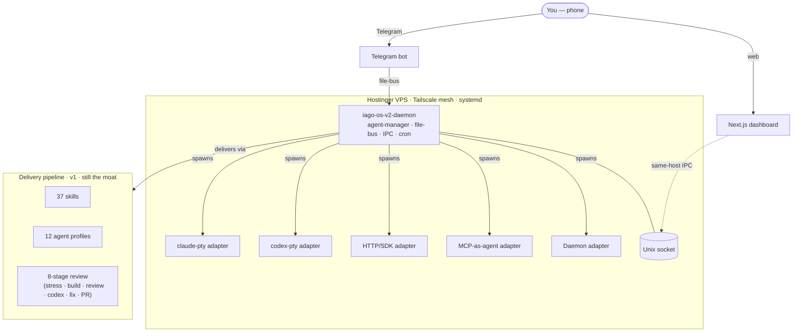

# iaGO-OS

<div align="center">


**A multi-agent operating system, controlled from your phone.**

*Hosts agents of any execution shape on a VPS. Ships client work through a hardened review pipeline. Built by the system itself.*

</div>

---

## What this is

**iaGO-OS is a multi-agent OS** that hosts agents of any execution shape — PTY-based CLI runtimes (Claude Code, Codex, Gemini, opencode), HTTP/SDK programs, MCP-as-agent servers, webhook/event workers, long-running daemons — on a Hostinger VPS reached over Tailscale, controlled from a phone via Telegram, observed through a web dashboard.

It is also the delivery system we use to ship our own client work and to build itself: a Claude Code configuration layer of 37 skills, 12 agent profiles, 8 hooks, and a cross-model review pipeline that gets fresh `claude -p` sessions to plan → implement → build → review → ship under discipline.

> **Two layers, one repo.** The OS (v2) runs on the VPS. The delivery pipeline (v1, still the moat) runs locally and in CI. The OS uses the pipeline to build itself.

**Who it's for:** Our 3-person AI consultancy (iaGO) and any team that wants to make Claude Code into a real delivery system rather than a blank-slate chatbot.

---

## The 5 layers

| # | Layer | What | Tech |
|---|---|---|---|
| 1 | **Runtime substrate** | Hostinger VPS + Tailscale mesh + systemd | OS-native, no Docker |
| 2 | **Agent execution** | Daemon hosting `AgentRuntime` adapters across 5 shapes; file-bus coordination; crash markers + auto-restart; `session.jsonl` replay; heartbeat health; subagent semantics | Node 20 + TypeScript strict + JSON/SQLite |
| 3 | **Control plane** | Telegram-primary phone control (start/stop/inject/approve/abort); file-based approval handshake; cross-runtime event router | Telegram Bot API + file-bus |
| 4 | **Dashboard** | Live agent state across all shapes, token spend per agent/project/model, intervention controls; same-host IPC, not REST | Next.js + Unix socket IPC |
| 5 | **Pipeline (preserved)** | Cross-model Codex review, severity floors, secret-exclusion staging, skill routing, stress test — *this is the moat* | `claude -p` + Codex CLI + GitHub Actions |



---

## Quick start

```bash
# 1. Clone
git clone https://github.com/ilsantino/iago-os.git && cd iago-os

# 2. Install skills + agents globally
./scripts/sync-skills.sh --global

# 3. (Optional) memory stack — Obsidian + Graphify + MemPalace + SQLite on top of MEMORY.md. Architecture + retrieval routing in .claude/rules/memory.md
bash scripts/setup-memory.sh        # macOS / Linux / Git Bash
.\scripts\setup-memory.ps1          # Windows PowerShell

# 4. Scaffold a client project
./scripts/new-client.sh --name "My Client" --project "my-app" --path ../my-app

# 5. Start working
cd ../my-app && claude
```

Inside Claude Code on a client project:

```
> /iago-init                    # Discovery → PROJECT.md + ROADMAP.md
> /iago-discuss phase 1         # Clarify ambiguities → context artifact
> /iago-plan phase 1            # Decompose → plan files (with stress test)
> /iago-execute phase 1         # Pipeline → build → review → PR
> /iago-verify phase 1          # Goal verification → ship or re-plan
```

Bypass modes:

```
> /iago-quick "Add email validation to the form"   # 1-3 tasks, full pipeline
> /iago-fast  "Fix typo in login button"           # Inline, build gate only
> /iago-prfix                                      # Auto-fix PR review comments
```

See the [Prerequisites](#prerequisites) section below for tools to install. After cloning, run `./scripts/sync-skills.sh --global` (Linux/macOS/Git Bash) or `.\scripts\sync-skills.ps1 -Global` (PowerShell) to make all iaGO-OS skills available in every Claude Code session. Authenticate Claude (`claude`), AWS (`aws configure`), and GitHub (`gh auth login`) before scaffolding your first project.

---

## Ecosystem integrations

### Codex (cross-model)

GPT-5.5 via Codex CLI for a second opinion from a different model family. Each operator pins their model in `~/.codex/config.toml`:

```toml
model = "gpt-5.5"
model_reasoning_effort = "high"
```

Requires Codex CLI ≥ 0.125.0. GPT-5.5 is currently ChatGPT-sign-in only during rollout.

| Skill | What |
|---|---|
| `/codex:adversarial-review` | Mandatory cross-model review on every plan |
| `/codex:review` | Read-only GPT-5.5 code review |
| `/codex:rescue` | Delegate debugging/implementation to Codex in background |
| `/codex:status` / `/codex:result` / `/codex:cancel` | Manage background Codex jobs |

### MCP servers

| Server | What | Setup |
|---|---|---|
| `context7` | Live library/framework docs | Built-in |
| `obsidian` | Read/write access to Obsidian vault | Built-in |
| `markitdown` | DOCX, PPTX, XLSX, EPub, large PDFs, YouTube → markdown | Global install |
| `youtube-transcript` | YouTube transcripts via InnerTube | Global install |
| `mempalace` | Semantic search over conversation history + agent diary | `setup-memory.sh` |
| `graphify` | Knowledge graph queries | `setup-memory.sh` |

---

## Folder structure

```
iago-os/
  runtime/            # v2 daemon (Node 20 + TS strict) — adapters, file-bus, IPC, Telegram
  .claude/            # settings.json, skills/, agents/, rules/
  .iago/              # plans/, summaries/, reviews/, STATE.md, hooks/
  scripts/            # execute-pipeline.sh, review-checks/, new-client, sync-skills, setup-memory
  docs/               # specs/ (canonical specs only — other historical docs in .iago/_archive/)
```

---

## Prerequisites

| Tool | Min version | Install | Verify |
|---|---|---|---|
| **Node.js** | 20+ | [nodejs.org](https://nodejs.org/) | `node --version` |
| **Git** | 2.30+ | [git-scm.com](https://git-scm.com/) | `git --version` |
| **Claude Code** | Latest | `npm install -g @anthropic-ai/claude-code` | `claude --version` |
| **GitHub CLI** | 2.x | [cli.github.com](https://cli.github.com/) | `gh --version` |
| **AWS CLI** | 2.x | [AWS docs](https://docs.aws.amazon.com/cli/latest/userguide/getting-started-install.html) | `aws --version` |

Optional:

| Tool | What for | Install |
|---|---|---|
| **Codex CLI** | Cross-model GPT-5.5 review (≥ 0.125.0 for `gpt-5.5`) | `npm install -g @openai/codex@latest` |
| **Python 3.10+** | Memory stack (MemPalace + Graphify) | [python.org](https://python.org/downloads/) |
| **Playwright** | E2E testing | `npx playwright install` |
| **GNU coreutils** | macOS only — for `gtimeout` / `gsort` used by `execute-pipeline.sh` | `brew install coreutils` |

---

## Tech stack

See [`.claude/rules/stack.md`](.claude/rules/stack.md) for the authoritative stack list (frontend, backend, agents, testing, tooling, infra). v2 OS runtime is Node 20 + TypeScript strict + ESM on Debian 13 / Tailscale / systemd; client projects use React 19 + Vite + AWS Amplify Gen 2.

---

## Built on

iaGO-OS synthesizes patterns from upstream Claude Code configurations and v2 adopts primitives from cortextOS + Hermes.

| Upstream | What we took |
|---|---|
| [cortextOS](https://github.com/grandamenium/cortextos) | PTY adapter per runtime, `O_EXCL` file-lock task claiming, file-based approval handshake, `.daemon-stop` crash markers, multi-org agent resolution, `session.jsonl` replay, subagent semantics, heartbeat health, IPC server, full Next.js dashboard |
| [Hermes v0.11](https://github.com/NousResearch/hermes-agent) | Pre-LLM cron wake gate, shell-hook matchers, MCP sampling caps + rate-limiter, compression-threshold safety valve, parallel delegation limit |
| [Everything Claude Code](https://github.com/affaan-m/everything-claude-code) | Session lifecycle model, post-edit pipeline, config protection |
| [Ruflo](https://github.com/ruvnet/ruflo) | Token tracking from JSONL, context injection, statusline |
| [Get Shit Done](https://github.com/gsd-build/get-shit-done) | HANDOFF.json pause/resume |
| [Paperclip](https://github.com/paperclipai/paperclip) | Multi-client isolation model |
| [Superpowers](https://github.com/obra/superpowers) | Verification discipline, anti-performative-agreement rules |

---

## Documentation

| Doc | Covers |
|---|---|
| [docs/specs/iago-os-v2-vision.md](docs/specs/iago-os-v2-vision.md) | **Canonical v2 vision** — 5-shape agent taxonomy, phase sequencing, primitive provenance |
| [.iago/_config/architecture.md](.iago/_config/architecture.md) | How iaGO-OS works under the hood (v1 delivery layer architecture) |
| [.claude/rules/execution-pipeline.md](.claude/rules/execution-pipeline.md) | Pipeline stages, workflow phases, async review-fix loop |
| [.iago/_config/runbooks/github-pipeline-setup.md](.iago/_config/runbooks/github-pipeline-setup.md) | Step-by-step GitHub PAT + Claude OAuth setup for the review-fix loop |
| [.iago/_config/runbooks/dashboard.md](.iago/_config/runbooks/dashboard.md) | iaGO Dashboard runbook |
| [runtime/README.md](runtime/README.md) | v2 daemon adapter authoring guide |
| [.claude/rules/available-skills.md](.claude/rules/available-skills.md) | Skill + agent catalog with triggers, args, examples |
| [.iago/STATE.md](.iago/STATE.md) | Live digest — what shipped, what's in flight, known issues |

---

## License

Proprietary. Copyright iaGO AI.
